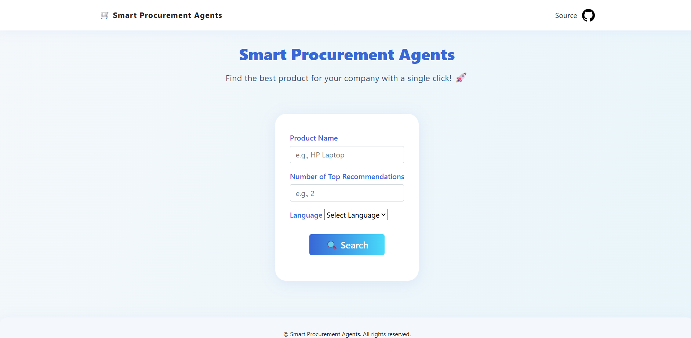
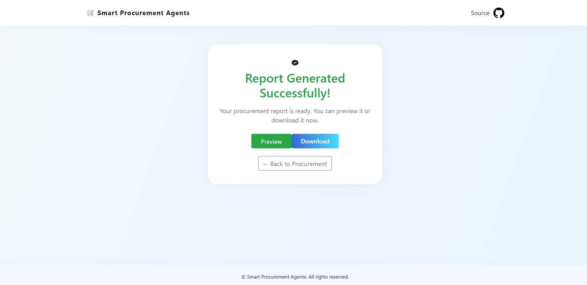

# 🛒 Smart Procurement Agents

> **AI-driven multi-agent system that searches regional e-commerce sites, extracts product data, and produces an executive-ready HTML procurement report—all in one click.**




---

##  Key Features

| Capability                        | Description                                                                                                       |
| --------------------------------- | ----------------------------------------------------------------------------------------------------------------- |
|  **Intelligent Product Search** | Generates laser-focused search queries for each target website, ensuring results land on real product pages only. |
|  **Resilient Web Scraping**    | Extracts price, specs, images, and availability from noisy HTML—even skips broken links gracefully.               |
|  **Automated Reporting**        | Builds a polished, Bootstrap-styled HTML report (Executive Summary → Recommendations) in English *or* Arabic.     |
|  **Multi-Site & Multi-Country** | Configure any set of e-commerce domains (defaults tuned for Syria).                                               |
|  **AgentOps Monitoring**        | All agent runs are tracked for replay & observability.                                                            |
|  **Pluggable LLM Providers**    | Uses OpenRouter / GPT-4o / DeepSeek-v3 by default—swap in any model with a single env change.                     |

---

##  Architecture

```
Flask UI  ─┐
           │  (POST /)              +─────────+
           └─▶ Procurement Crew ───▶│ Agents  │─────┐
                  (crewai)          +─────────+     │
                       ▲                             │
                       │                             ▼
                 ▼ SearchQueryAgent         ↘ JSON results
     user input ─┤ SearchEngineAgent        ↘
                 ▼ WebScraperAgent           ▼
                 ▼ ReportAuthorAgent   HTML report
```

* **CrewAI** orchestrates four independent agents in sequential order.
* Each agent has its own LLM, tools, and Pydantic I/O schema.
* Reports are saved to `src/ai-agent-output/step_4_procurement_report.html`.

---

##  Requirements

| Tool                                | Version                   |
| ----------------------------------- | ------------------------- |
| **Python**                          | 3.11+                     |
| **pip**                             | ≥ 23                      |
| **(Recommended)** Miniconda / Mamba | for environment isolation |

---

##  Quick Start

### 1 · Clone & Create Env

```bash
git clone https://github.com/your-org/smart-procurement-agents.git
cd smart-procurement-agents
conda create -n smart-procurement-agents python=3.11 -y
conda activate smart-procurement-agents
```

### 2 · Install Dependencies

```bash
pip install -r requirements.txt
```

### 3 · Configure Environment Variables

```bash
cp .env.example .env
# then edit .env with your keys
```

| Variable                                      | Purpose                   | Get Key                                                                    |
| --------------------------------------------- | ------------------------- | -------------------------------------------------------------------------- |
| `OPEN_ROUTER_API_KEY`                         | LLM access via OpenRouter | [openrouter](https://openrouter.ai/settings/keys)                          |
| `Agentops_API_KEY`                            | Agent telemetry & replay  | [agentops](https://agentops.com/)                                          |
| `TVLY_SEARCH_API_KEY`                         | Tavily web search         | [tavily/](https://tavily.ai/)                                              |
|   `OPENAI_API_KEY`                            | alternate LLM back-ends   | [OpenAI](https://platform.openai.com)                                      |
|  `GROQ_API_KEY`                               | alternate LLM back-ends   | [groq](https://groq.com/)                                                  |
### 4 · Run the App

```bash
python app.py           # default port 5000
# └─ visit http://127.0.0.1:5000
```

Stop with **Ctrl + C**.

---

##  Usage Walk-Through

1. **Home page** – enter *Product Name*, number of top recommendations, and language.
2. Click **Search**.
3. The Crew launches:

   * `SearchQueriesRecommendationAgent` ➜ generates site-specific queries.
   * `SearchEngineAgent` ➜ fetches results via Tavily API.
   * `WebScraperAgent` ➜ scrapes each product page, outputs structured JSON.
   * `ProcurementReportAgent` ➜ composes the final HTML report.
4. You’re redirected to **Result Page** where you can **Preview** or **Download** the report.

---

##  Project Structure

```
smart-procurement-agents/
│
├─ app.py                 # Flask entry-point
├─ crew.py                # CrewAI orchestration
├─ src/
│   ├─ Agents/            # four agent definitions + tasks
│   ├─ models/            # Pydantic schemas
│   ├─ tools/             # search & scraping tools
│   └─ utils/             # helper functions (clean_report, ...)
│
├─ templates/             # Jinja2 HTML pages
├─ static/                # CSS, JS, images
└─ requirements.txt
```

---


##  Contributing

1. Fork the repo & create a feature branch.
2. Commit your changes with clear messages.


We welcome new e-commerce site connectors, UI enhancements, and additional languages! 


---

*Built with ❤️ using CrewAI, Flask, and OpenAI GPT-4o.*
